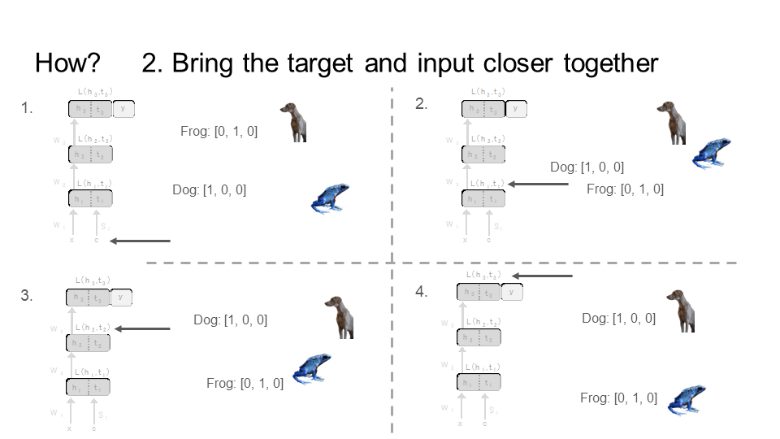
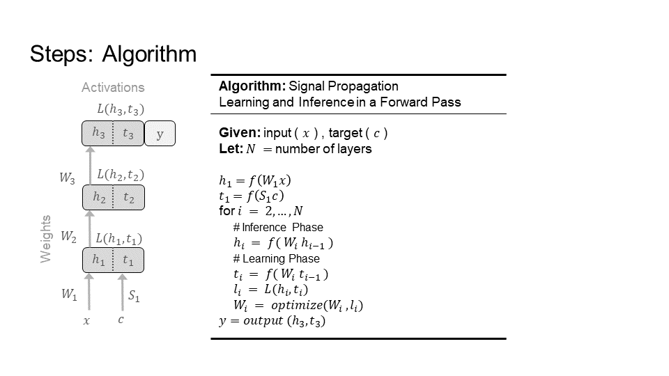

On this page, I present the Signal Propagation framework for inference and learning in a forward pass. This is a framework for using only forward passes to learn any kind of data and on any kind of network. I demonstrate it works well for discrete networks, continuous networks, and spiking networks, all without modification to the network architecture. In other words, the network used for inference is the same as the network used for learning. As a result, Signal Propagation is a least constrained method for learning, and yet has better performance, efficiency, and compatibility than previous alternatives to backpropagation.

Table of Contents
+ [Motivation](#motivation)
+ [Solution](#solution)
+ [Spiking Networks](#spiking-networks)

## Background
Learning is the active ingredient to make artificial neural networks work. Backpropagation is recognized as the best performing learning algorithm, powering the success of artificial neural networks. However, it is a highly constrained learning algorithm. And, it is these constraints that are seen as necessary for its high performance. It is well accepted that reducing even some of these constraints lowers performance. However, due to these same constraints, backpropagation has problems with efficiency and compatibility. It is not efficient with time, memory, and energy. It has low compatibility with biological models of learning, neuromorphic chips, and edge devices. So, one may think to address this problem by reducing different subsets of constraints in an attempt to increase efficiency and compatibility without heavily lowering performance.

Previous alternative learning algorithms to backpropagation attempt this. They selectively reduce constraints on learning to improve efficiency and compatibility. They keep other constraints with the expectation of retaining performance similar to that found by keeping all the constraints, also known as backpropagation. So, this implies that there is a spectrum for learning constraints, from highly constrained, such as backpropagation, to no constraints, such as Signal Propagation.

## Introduction
Now, we demonstrate a shift from previous works. The results presented here provide support that the least constrained learning method, Signal Propagation, has better performance, efficiency, and compatibility than alternatives to backpropagation that selectively reduce constraints on learning. This includes well established and highly impactful methods such as random feedback alignment, direct feedback alignment, and local learning (the versions with backpropagation). This is a surprising insight into learning - in general - across fields from neuroscience to computer science. It benefits areas from biological learning (e.g. in the brain) to artificial learning (e.g. in neural networks, hardware, neuromorphic chips). 

It also significantly informs the direction of future research in learning algorithms where backpropagation is the standard to compare with. Now, opposite to the highly constrained backprogation, on the spectrum of learning constraints, Signal Propagation is the least constrained method to compare with and start from for developing learning algorithms. With only backpropagation as a best case comparison, learning algorithms did not have a starting point, only an end goal. Now, Signal Propagation is the new baseline for learning algorithms to assess their efficiency, compatibility, and performance.

# Motivation

What are the constraints found under backpropagation, and why are they an issue?

Learning constraints under backpropagation are difficult to reconcile with learning in the brain
- Complete forward pass through the network before sequentially delivering feedback in reverse order during a backward pass
- Comprehensive feedback connectivity necessary for every neuron
- Feedback is a distinct type of computation, separate from feedforward activity
- Weight symmetry

These constraints also hinder efficient implementations of learning algorithms on hardware
- weight symmetry is incompatible with elementary computing units which are not bidirectional
- transportation of non local weight and error information requires special communication channels.

Constraints prohibit parallelization of computations during learning and bound memory and compute
- The forward pass needs to complete before the backward pass can begin (Time, Sequential)
- Activations of hidden layers need to be stored during the forward pass for the backward pass (Memory)
- Backward pass requires special feedback connectivity
- Parameters are updated in reverse order of the forward pass (Time, Synchronous)

<picture>
 
</picture>

## Spatial Credit Assignment

Spatial Locality of Credit Assignment is the question: How does the learning signal reach every neuron?

The learning signal (colored in red) needs to reach every neuron in the network. Different learning algorithms have different solutions to this question. Broadly, there are two approaches. The first approach computes a global learning signal (left image) and then sends this learning signal to every neuron. The second approach computes a local learning signal (right image) at each neuron (or layer). The first approach has the problem of having to coordinate sending this signal to every neuron in a precise way. This is costly in time, memory, and compatibility. The second approach does not, but has worse performance.

<picture>
 
</picture>

## Temporal Credit Assignment

Temporal Locality of Credit Assignment is the question: How does the global learning signal reach every time step?

A single image requires only that the learning signal reach every neuron. However, a video is a series of related images. So, now the learning signal needs to travel through time, starting from the last image in the video all the way to the first image in the video. This applies to any sequential or time series data. There are two popular methods to answer this question: Backpropagation through time, and forward mode differentiation.

### Backpropagation Through Time (BPT)
The primary answer to this question is as follows. First, input all the images that make up the video, one by one, into the network. This is forward through time. Second, go backwards from the last image to the first image propagating the learning signal. This is backward through time.

#### Forward through time
Each image X[i], that make up the video, are fed through the network. We start with the 1st image X[0] (bottom left of the first image), which is time step 1 (time is shown at the top of the image). Next, we feed in image X[1], which is time step 2. Finally, we end with the last image X[2] at time step 3 - this demonstration is for a very short video, or gif. Every time we feed an image to the network notice that the middle layer in the network connects each image to each other through time. 
<table>
<tr>
<td>
<picture>
 
</picture>
</td>
<td>
<picture>
 
</picture>
</td>
<td>
<picture>
 
</picture>
</td>
</tr>
</table>

#### Backward through time
Each the learning signal, colored in red, goes backward through the time. The learning signal is formed from the loss. Then, it travels in the opposite direction of how we fed in the images X[i]. First a gradient/update is calculated for image X[2] at time 3, then image X[1] at time 2, and finally image X[0] at time 1. This is why it is called backpropagation through time. Again, notice that the middle layer in the network connects the learning from the last image X[2] to the first image X[0].
<table>
<tr>
<td>
<picture>
 
</picture>
</td>
<td>
<picture>
 
</picture>
</td>
<td>
<picture>
 
</picture>
</td>
</tr>
</table>

### Forward Mode Differentiation (FMD)
This method propagates the learning signal forward in time. So, the learning signal no longer needs to travel from the last image in the video back to the first. It travels in the same direction as the images from the video. However, it is more costly than BPT.

<table>
<tr>
<td>
<picture>
 
</picture>
</td>
<td>
<picture>
 
</picture>
</td>
<td>
<picture>
 
</picture>
</td>	
</tr>
</table>

# Solution

## Signal Propagation, sigprop, or SG

Free constraints for learning to take place
- only a forward pass, no backward pass
- no feedback connectivity or symmetric weights
- only one type of computation for learning and inference.
- learning signal travels with the input in the forward pass
- update parameters once the layer is reached by the forward pass
- explains how neurons without error feedback connections receive global learning signals

## How

First, treat the target as an input.
<picture>
 
</picture>

Then, we will bring the target and the input closer and closer together as we move through the network, starting from the first layer (top left) and all the way to the last layer (bottom right). Notice that by the last step, the image of the dog is close to its target [1,0,0], and the image of the frog is close to its target [0, 1, 0]. However, the image and target of the dog is far away from the frog.
<picture>
 
</picture>

## Steps

Here is the total picture for an example three layer network. Each layer has its own loss, so we can update the weights as we move through the network bringing the target and input closer together, from the first to the last layer.
<picture>
 
</picture>

Now, we will go step by step, layer by layer, doing learning and inference (i.e. producing an answer/prediction) in forward passes.

### [Step 1] Layer 1
<picture>
 
</picture>
<picture>
 
</picture>	
<picture>
 
</picture>	

### [Step 2] Layer 2
<picture>
 
</picture>	
<picture>
 
</picture>	
<picture>
 
</picture>	

### [Step 3] Layer 3
<picture>
 
</picture>	
<picture>
 
</picture>	

### Complete Procedure

<picture>
 
</picture>	
<picture>
 
</picture>	

## Spiking Networks

Spiking neural networks are more similar to biological neural networks. The neurons in these networks spike to convey information to another neuron, or do nothing (top left image). So, these networks have a problem where neurons stop working entirely, which means they never spike (bottom left image). This is called the dead neuron problem.

The most popular approach to deal with this problem is to use a surrogate function to replace the spiking. The surrogate is only used during learning, when the learning signal is going to the neurons. The surrogate function provides a value for the neuron even when it does not spike (top right image). So, the neuron learns even when it does not spike to convey information to another neuron (bottom right image). This helps stop the neuron from dying. However, surrogates are difficult for learning in hardware, such as neuromorphic chips. Furthermore, surrogates do not fit models of learning in the brain. Signal Propagation provides a solution - two solutions.

<picture>
 
</picture>	

Here is a visualization of the learning signal (colored in red) going through a spiking neuron. Backpropagation, with the dead neuron problem, is on the left. Backpropagation, with a surrogate function, is second. Then, we show the two solutions Signal Propagation (SP) provides. First, SP can use a surrogate as well, but the learning signal does not go through the spiking equation (shown as S). This is more compatible with learning in the brain, such as in a multi compartment model of a biological neuron. Second, SP can learn using only the voltage or membrane potential. This requires no surrogate or change to the neuron. So, it is compatible with learning in hardware. 
<picture>
 
</picture>	
