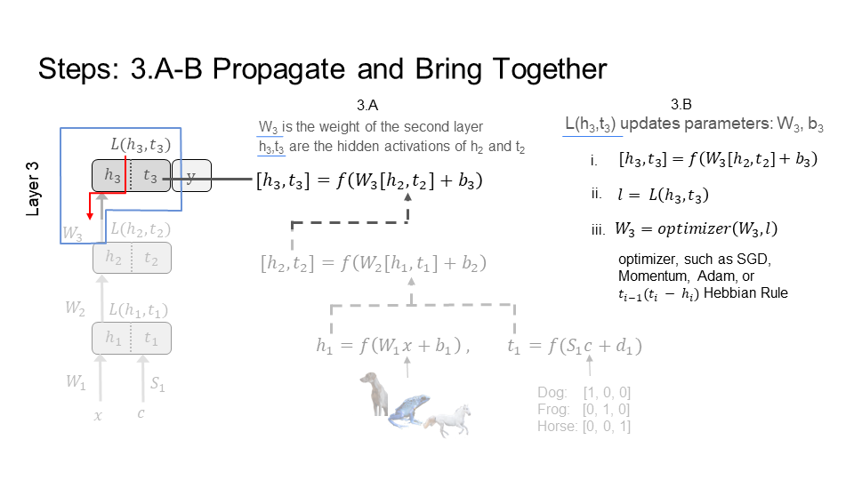

This page is a concise tutorial for learning in a forward pass. By the end of the tutorial, you will understand the concept, and know how to apply this form of learning in your work. The tutorial provides explanations for beginners, and detailed steps for experts. Use the table of contents to go where you want. If you have a work on forward learning, [add your work](#add-your-work) to this page.

On this page, I present the framework for inference and learning in a forward pass, called the Signal Propagation framework. This is a framework for using only forward passes to learn any kind of data and on any kind of network. I demonstrate it works well for discrete networks, continuous networks, and spiking networks, all without modification to the network architecture. In other words, the network used for inference is the same as the network used for learning. In contrast, backpropagation and previous works have a different structure and algorithm for the training network than for the inference network, which are referred to as learning constraints. As a result, Signal Propagation is a least constrained method for learning, and yet has better performance, efficiency, and compatibility than previous alternatives to backpropagation. It also has better efficiency and compatibility than backpropagation. This framework is introduced in [https://arxiv.org/abs/2204.01723](https://arxiv.org/abs/2204.01723) .

Table of Contents
+ [Introduction](#introduction)
  + [Problem Statement](#problem-statement)
+ [Learning in a Forward Pass](#learning-in-a-forward-pass)
  + [How](#how)
  + [Steps](#steps)
+ [Spiking Networks](#spiking-networks)
+ [Works on Forward Learning](#works-on-forward-learning)
  + [Forward Forward](#forward-forward-algorithm)
  + [Add Your Work](#add-your-work)
+ [Reading Material](#reading-material)

## Introduction

### Background
Learning is the active ingredient in making artificial neural networks work. Backpropagation is recognized as the best performing learning algorithm, powering the success of artificial neural networks. However, it is a highly constrained learning algorithm. And, it is these constraints that are seen as necessary for its high performance. It is well accepted that reducing even some of these constraints lowers performance. However, due to these same constraints, backpropagation has problems with efficiency and compatibility. It is not efficient with time, memory, and energy. It has low compatibility with biological models of learning, neuromorphic chips, and edge devices. So, one may think to address this problem by reducing different subsets of constraints in an attempt to increase efficiency and compatibility without heavily lowering performance. 

For example, two constraints of backpropagation on the training network are: (1) the addition of feedback weights that are symmetric with the feedforward weights; and (2) the requirement of having these feedback weights for every neuron. The inference network never uses the feedback weights, that is why we refer to them as learning constraints. Subsets of these constraints include: not adding any feedback weights, only adding feedback weights for one or two layers in a five layer network, not having the feedback weights be symmetric, or any combination of these. This means constraints can be added or removed in part or entirely to form subsets of constraints to reduce. One may keep trying to reduce different subsets of these constraints, in an attempt to increase efficiency and compatibility, and hope to not heavily impact performance.

Previous alternative learning algorithms to backpropagation have attempted relaxing constraints, without success. They reduce subsets of constraints on learning to improve efficiency and compatibility. They keep other constraints, with the expectation of retaining performance similar to the performance found by keeping all the constraints (which is backpropagation). So, this implies there is a spectrum for learning constraints, from highly constrained, such as backpropagation, to no constraints, such as Signal Propagation, the framework I am introducing here.

### A New Framework for Learning
Now, I demonstrate a shift away from previous works. The results presented here provide support that the least constrained learning method, Signal Propagation, has better performance, efficiency, and compatibility than alternatives to backpropagation that selectively reduce constraints on learning. This includes well established and highly impactful methods such as random feedback alignment, direct feedback alignment, and local learning (all without backpropagation). This is a fascinating insight into learning across fields from neuroscience to computer science. It benefits areas from biological learning (e.g. in the brain) to artificial learning (e.g. in neural networks, hardware, neuromorphic chips). 

Signal Propagation also significantly informs the direction of future research in learning algorithms where backpropagation is the standard of comparison. On the spectrum of learning constraints, contrary to the highly constrained backpropagation, Signal Propagation is the least constrained method to compare with and to start from for developing learning algorithms. With only backpropagation as a best performing comparison, learning algorithms did not have a starting point, only an end goal. Now, I am introducing Signal Propagation as the new baseline for learning algorithms to assess their efficiency, compatibility, and performance.

### Problem Statement
 
What are the constraints found under backpropagation?\
Why are they an issue?

Learning constraints under backpropagation are difficult to reconcile with learning in the brain. Below, I provide the main constraints: 
- A complete forward pass through the network is required before sequentially delivering feedback in reverse order during a backward pass. 
- The training network needs the addition of comprehensive feedback connectivity for every neuron. 
- There are two different computations for learning and for inference. In other words, the feedback algorithm is a distinct type of computation, separate from feedforward activity.
- The feedback weights need to be symmetric with the feedforward weights.

These constraints also hinder efficient implementations of learning algorithms on hardware for the following reasons: 
- weight symmetry is incompatible with elementary computing units which are not bidirectional.
- transportation of non local weight and error information requires special communication channels.

These learning constraints prohibit parallelization of computations during learning and increase memory and compute for the following reasons:
- The forward pass needs to complete before the backward pass can begin (Time, Sequential)
- Activations of hidden layers need to be stored during the forward pass for the backward pass (Memory)
- Backward pass requires special feedback connectivity (Structure)
- Parameters are updated in reverse order of the forward pass (Time, Synchronous)

<picture>
 
</picture>

### Learning

How does learning function in neural networks?

There are two primary forms of data: individual inputs, and multiple connected inputs which are sequentially or temporally connected. An image of a dog is an individual input as the network makes a prediction based solely on that image. In this case, the network is given a single image to predict if the image is of a dog or turtle. 

A video of a turtle walking is multiple connected inputs as videos are made up of multiple images, and the networks makes a prediction after seeing all of these images. In this case, the network is given multiple images to predict if the turtle is walking or hiding. 

Backpropagation (BP) is used for individual inputs; backpropagation through time (BPT) is used for multiple connected inputs.

BP provides learning for:
- Every neuron (spatial credit assignment)

BPT provides learning for:
- Every neuron (spatial credit assignment)
- Multiple connected inputs (temporal credit assignment)

Providing learning for every neuron is known as the spatial credit assignment problem. Spatial credit assignment refers to  the placement of neurons in the network, such as organized into layers of neurons. For example, in a five layer network, the backpropagation learning signal travels from the fifth layer sequentially all the way down to the first layer of neurons.

Providing learning for multiple connected inputs is known as the temporal credit assignment problem. Temporal credit assignment refers to moving through the multiple connected inputs. For example, each image in the video is fed into the network, producing a new response from the same neurons. Each neuron response is specific to each of the images/inputs. So, the backpropagation learning signal travels through each of these neuron responses, from the neuron response for the last image in the video to the neuron response for the first image.

Note, the inner problem of temporal credit assignment is spatial credit assignment. Temporal learning assignment takes the learning signal through each of the images of the video. For each image, spatial credit assignment takes the learning signal to each neuron.

BP does spatial credit assignment. BPT extends BP to do both temporal and spatial credit assignment.

### Spatial Credit Assignment

Spatial Locality of Credit Assignment is the question: How does the learning signal reach every neuron?

On the left of the figure below, is a three layer network. In general, learning takes place in two phases. First, the inference phase, where the input is fed through the network from the first layer up to the last layer. Since the input is fed forward through the network, inference takes place during the "forward pass" through the network. Second, the learning phase, where the learning signal (colored in red) needs to reach every neuron in this network. In backpropagation, the learning signal goes backward through the network, so learning takes place during the "backward pass" through the network. As we will see with Signal Propagation, learning can take place during the forward pass as well.

Different learning algorithms have different solutions to this question. Broadly, there are two approaches to the learning phase. The first approach computes a global learning signal (left middle figure) and then sends this learning signal to every neuron. The second approach computes a local learning signal (right figure) at each neuron (or layer). The first approach has the problem of having to coordinate sending this signal to every neuron in a precise way. This is costly in time, memory, and compatibility. The second approach does not encounter this problem, but has worse performance.

<picture>
 
</picture>

### Temporal Credit Assignment

Temporal Locality of Credit Assignment is the question: How does the global learning signal reach multiple connected inputs (aka every time step)?

A single image requires only that the learning signal reach every neuron. However, a video is a series of connected images. So, now the learning signal needs to travel through multiple connected inputs (aka time), starting from the last image in the video all the way to the first image in the video. This concept applies to any sequential or time series data. So, how does the global learning signal reach every time step? There are two popular methods to answer this question: Backpropagation through time, and forward mode differentiation.

#### Backpropagation Through Time (BPT)
The primary answer to the question posed above follows, and takes place in two phases. First, input all the images that make up the video, one by one, into the network. This is the inference phase where the multiple connected inputs are sent forward through the network (a forward pass). Second, go backwards from the last image to the first image propagating the learning signal. This is the learning phase where the learning signal goes backward (a backward pass) through the multiple connected inputs (aka time); thus the name backpropagation through time.

##### Step 1: Inference
In the figure below, BPT feeds each image X[i] (e.g. of the turtle walking), which makes up the video, through the network. BPT starts with the 1st image X[0] (bottom left of the first figure), which is time step 1 (time is shown at the top of the figure). Next, BPT feeds in image X[1], which is time step 2. Finally, we end with the last image X[2] at time step 3 - this demonstration is for a very short video, or gif. Every time BPT feeds an image to the network notice that the middle layer in the network connects each image to the next image through time. 
<table>
<tr>
<td>
<picture>
 
</picture>
</td>
<td>
<picture>
 
</picture>
</td>
<td>
<picture>
 
</picture>
</td>
</tr>
</table>

##### Step 2: Learning Backward through time
BPT feeds the learning signal, colored in red, backward through the images (time), making up the video of the turtle walking. The learning signal is formed from the loss function (top right of figure). It travels in the opposite direction of how we fed in the images X[i]. First a gradient/update is calculated for image X[2] at time 3, then image X[1] at time 2, and finally image X[0] at time 1. This is why it is called backpropagation through time. Again, notice that the middle layer in the network connects the learning signal from the last image X[2] to the first image X[0].
<table>
<tr>
<td>
<picture>
 
</picture>
</td>
<td>
<picture>
 
</picture>
</td>
<td>
<picture>
 
</picture>
</td>
</tr>
</table>

#### Forward Mode Differentiation (FMD)
Under FMD, the behavior of the inference (step 1) and learning (step 2) phases are similar to each other. As a result, FMD does step 1 (inference) and step 2 (learning) together (alternating). How? In step 2, FMD propagates the learning signal forward through the images (time), much the same as inference does in step 1. So, the learning signal no longer needs to travel from the last image X[3] in the video back to the first X[0]. The result: FMD has a learning signal that starts with X[0], instead of having to wait for X[3]. 

Why FMD vs BPT? Above, I discussed the learning constraints under backpropagation and the problems it has with efficiency and compatibility. FMD attempts to improve efficiency. Particularly, BPT feeds all of the images, making up the video, into the network before learning. FMD does not, so it is more efficient in time than BPT. However, FMD is significantly more costly than BPT, particularly in memory and computation. Note that FMD addresses time. However, it does not help with the learning constraints on spatial credit assignment found under backpropagation, which exist in FMD as well.

<table>
<tr>
<td>
<picture>
 
</picture>
</td>
<td>
<picture>
 
</picture>
</td>
<td>
<picture>
 
</picture>
</td>	
</tr>
</table>

## Learning in a Forward Pass

### The Signal Propagation Framework (SP)
I present here, the Framework for Learning and Inference in a Forward Pass, called Signal Propagation. It is a satisfyingly straightforward solution to temporal and spatial credit assignment. SP is a least constrained method for learning, and yet has better performance, efficiency, and compatibility than previous alternatives to backpropagation. It also has better efficiency and compatibility than backpropagation. SP provides a reasonable performance tradeoff for efficiency and compatibility; significantly better than previous approaches. (In general, backpropagation is the best performing algorithm.)

SP is free of constraints for learning to take place, with:
- only a forward pass, no backward pass
- no feedback connectivity or symmetric weights
- only one type of computation for learning and inference.
- a learning signal which travels with the input in the forward pass
- updates to parameters once the neuron/layer is reached by the forward pass

An interesting insight, SP provides an explanation for how neurons in the brain without error feedback connections receive global learning signals.

As a result, Signal Propagation is:
- Compatible with models of learning in the brain and in hardware.
- More efficient in learning, with lower time, memory, and structure.
- A low complexity algorithm for learning.

### How?

SP treats the target as an additional input. With this approach, SP feeds the target forward through the network, as if it were an input.
<picture>
 
</picture>

SP moves forward through the network, bringing the target and the input closer and closer together, starting from the first layer (top left) all the way to the last layer (bottom right). Notice that by the last step/layer, the image of the dog is close to its target [1,0,0], and the image of the frog is close to its target [0, 1, 0]. However, the image and target of the dog is far away from the frog. SP trains the network to bring an input and its target closer together, but farther away from other inputs and their respective targets. 
<picture>
 
</picture>

### Steps

Below is the total picture for an example three layer network. Each layer has its own loss function, which is used to update weights in the network. So, SP executes the loss function and updates the weights as soon as the target and label reach a layer. Since SP feeds the target and input together (alternating), layer/neuron weights are updated immediately. For spatial credit assignment, SP updates weights without waiting for the input to reach the last layer from the first layer. For temporal credit assignment, SP provides a learning signal for (each time step) each of the multiple connected inputs (e.g. images in a video), without waiting for the last input to be fed into the network.
<picture>
 
</picture>

Below, we will go step by step, layer by layer, doing learning and inference (i.e. producing an answer/prediction) in forward passes. Note, in the guide below, the target and input are batch concatenated into a forward pass, making it easier to follow.
#### [Step 1] Layer 1
<picture>
 
</picture>
<picture>
 
</picture>	
<picture>
 
</picture>	

#### [Step 2] Layer 2
<picture>
 
</picture>	
<picture>
 
</picture>	
<picture>
 
</picture>	

#### [Step 3] Layer 3
<picture>
 
</picture>	
<picture>
 
</picture>	

#### Complete Procedure

<picture>
 
</picture>	
<picture>
 
</picture>	

### Spiking Networks

Spiking neural networks are similar to biological neural networks. They are used in models of learning in the brain. They are also used for neuromorphic chips. There are two problems for learning in spiking neural networks. First, the learning constraints under backpropagation are difficult to reconcile with learning in the brain, and hinders efficient implementations of learning algorithms on hardware (discussed above). Second, training spiking networks results in the dead neuron problem (see below).

The neurons in these networks respond to inputs by either activating (spiking) to convey information to another neuron or by doing nothing (top left image). Commonly, these networks have a problem where neurons never activate, which means they never spike (bottom left image). Thereby, regardless of the input, the neurons response is to always do nothing. This is called the dead neuron problem.

The most popular approach to resolve this problem uses a surrogate function to replace the spiking behavior of the neurons. The network uses the surrogate only during learning, when the learning signal is sent to the neurons. The surrogate function provides a value for the neuron even when it does not spike (top right image). So, the neuron learns even when it does not spike to convey information to another neuron (bottom right image). This helps stop the neuron from dying. However, surrogates are difficult to implement for learning in hardware, such as neuromorphic chips. Furthermore, surrogates do not fit models of learning in the brain. 

Signal Propagation provides two solutions that are compatible with models of learning in the brain and in hardware.

<picture>
 
</picture>	

Here is a visualization of the learning signal (colored in red) going through a spiking neuron. Backpropagation, with the dead neuron problem, is on the left. Backpropagation, with a surrogate function, is second. The other images on the right show the two solutions Signal Propagation (SP) provides. First, SP can use a surrogate as well, but the learning signal does not go through the spiking equation (shown as S). As a result, SP is more compatible with learning in the brain, such as in a multi compartment model of a biological neuron. Second, SP can learn using only the voltage or membrane potential. This requires no surrogate or change to the neuron. Thereby, SP provides compatibility with learning in hardware. 
<picture>
 
</picture>	

## Works on Forward Learning

### Forward Forward Algorithm

The forward forward algorithm is an implementation of the signal propagation framework for learning and inference in a forward pass (figure below). Under signal propagation, S is the transform of the context c, which for supervised learning is the target. In forward forward, S is a concatenation of the target with the input x, as shown in the figure below.

<picture>
 
</picture>	

Forward Forward Algorithm\
https://www.cs.toronto.edu/~hinton/FFA13.pdf

### Add your work
Contact me or submit a pull request to add a paragraph and slide on your work.

## Reading Material

Signal Propagation: A Framework for Learning and Inference In a Forward Pass\
https://arxiv.org/abs/2204.01723

Forward Forward Algorithm\
https://www.cs.toronto.edu/~hinton/FFA13.pdf

A well written guide on spatial and temporal credit assignment. I used it to help write this post.\
Training Spiking Neural Networks using lessons from deep learning\
https://arxiv.org/abs/2109.12894

## Citations
\[1] Image of 7 from MNIST dataset, http://yann.lecun.com/exdb/mnist/ \
\[2] Images of dogs, horses, and frogs from CIFAR Dataset, https://www.cs.toronto.edu/~kriz/cifar.html

