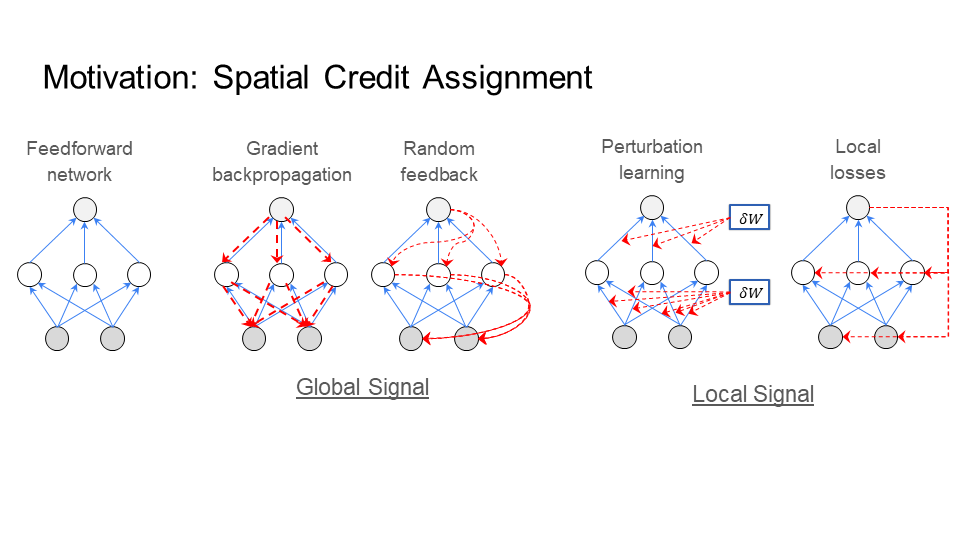
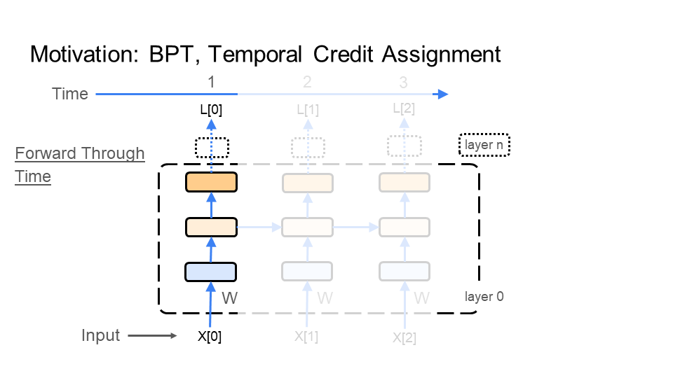
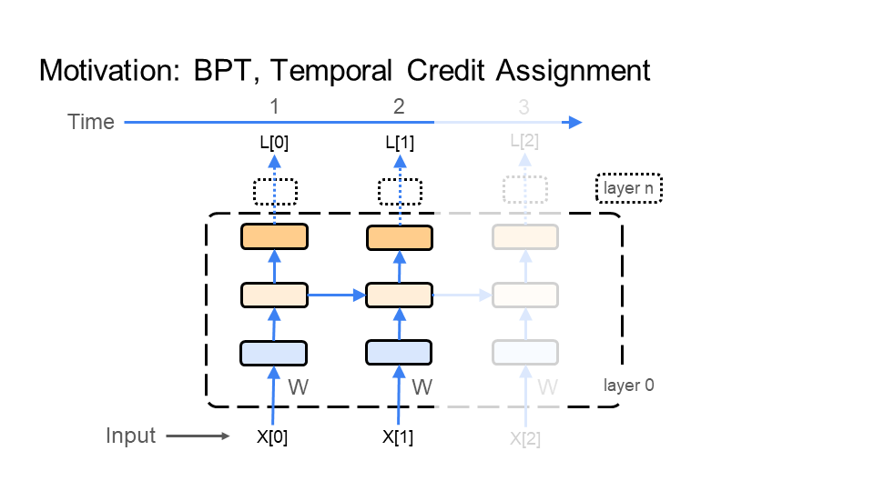
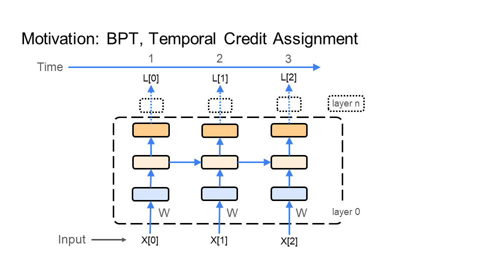
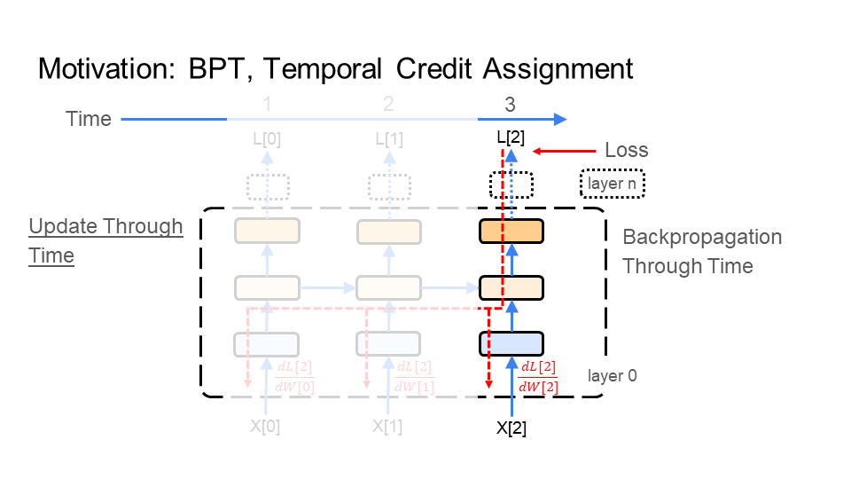
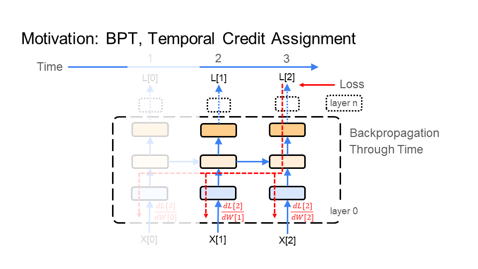
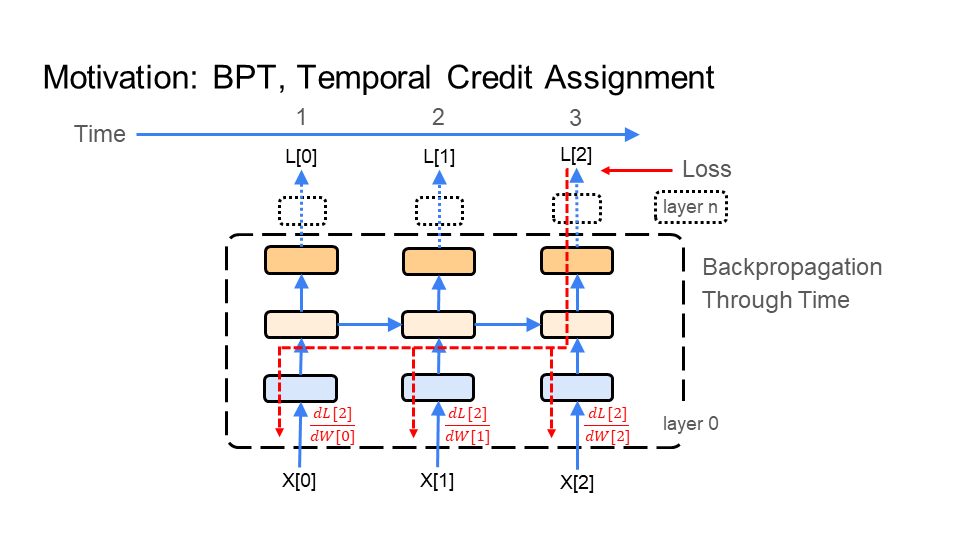
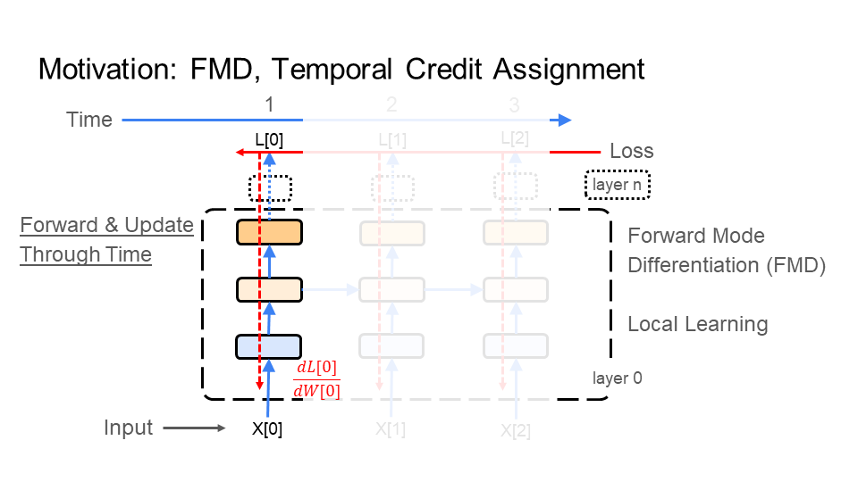
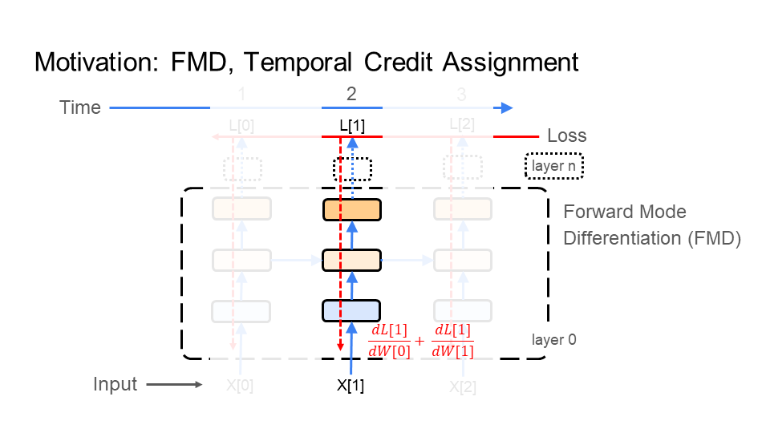
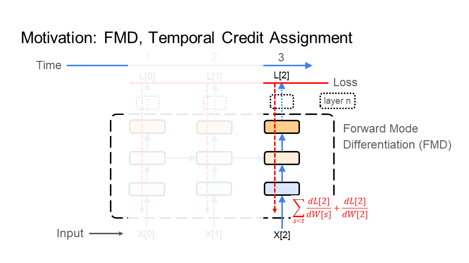

Table of Contents
6. [Appendix: Reading on Credit Assignment](#6-appendix-reading-on-credit-assignment)\
  6.1. [Spatial Credit Assignment](#61-spatial-credit-assignment)\
  6.2. [Temporal Credit Assignment](#62-temporal-credit-assignment)

## 6. Appendix: Reading on Credit Assignment

### 6.1. Spatial Credit Assignment
Spatial Locality of Credit Assignment is the question: How does the learning signal reach every neuron?

On the left of the figure below, is a three layer network. In general, learning takes place over two phases: the inference phase and the learning phase. In the first phase, called the inference phase, the input is fed through the network from the first layer up to the last layer. Since the input is fed forward through the network, the inference phase takes place during the "forward pass" through the network. In the second phase, called the learning phase, the learning signal (colored in red) needs to reach every neuron in this network.

Different learning algorithms have different solutions to the learning phase. In backpropagation, the learning signal goes backward through the network, so the learning phase takes place during the "backward pass" through the network. As we will see with Signal Propagation, learning can take place during the forward pass as well.

Broadly, there are two approaches to the learning phase. The first approach computes a global learning signal (left middle figure) and then sends this learning signal to every neuron. The second approach computes a local learning signal (right figure) at each neuron (or layer). The first approach has the problem of having to coordinate sending this signal to every neuron in a precise way. This is costly in time, memory, and compatibility. The second approach does not encounter this problem, but has worse performance.

<picture>
 
</picture>

### 6.2. Temporal Credit Assignment

Temporal Locality of Credit Assignment is the question: How does the global learning signal reach multiple connected inputs (aka every time step)?

A single image requires only that the learning signal reach every neuron. However, a video is a series of connected images. So, now the learning signal needs to travel through multiple connected inputs (aka time), starting from the last image in the video all the way to the first image in the video. This concept applies to any sequential or time series data. So, how does the global learning signal reach every time step? There are two popular methods to answer this question: Backpropagation through time, and forward mode differentiation.

#### 6.2.1. Backpropagation Through Time (BPT)
The primary answer to the question posed above follows, and takes place in two phases. First, input all the images that make up the video, one by one, into the network. This is the inference phase where the multiple connected inputs are sent forward through the network (a forward pass). Second, go backwards from the last image to the first image propagating the learning signal. This is the learning phase where the learning signal goes backward (a backward pass) through the multiple connected inputs (aka time); thus the name backpropagation through time.

##### Step 1: Inference
In the figure below, BPT feeds each image X[i] (e.g. of the turtle walking), which makes up the video, through the network. BPT starts with the 1st image X[0] (bottom left of the first figure), which is time step 1 (time is shown at the top of the figure). Next, BPT feeds in image X[1], which is time step 2. Finally, we end with the last image X[2] at time step 3 - this demonstration is for a very short video, or gif. Every time BPT feeds an image to the network notice that the middle layer in the network connects each image to the next image through time. 
<table>
<tr>
<td>
<picture>
 
</picture>
</td>
<td>
<picture>
 
</picture>
</td>
<td>
<picture>
 
</picture>
</td>
</tr>
</table>

##### Step 2: Learning Backward through time
BPT feeds the learning signal, colored in red, backward through the images (time), making up the video of the turtle walking. The learning signal is formed from the loss function (top right of figure). It travels in the opposite direction of how we fed in the images X[i]. First a gradient/update is calculated for image X[2] at time 3, then image X[1] at time 2, and finally image X[0] at time 1. This is why it is called backpropagation through time. Again, notice that the middle layer in the network connects the learning signal from the last image X[2] to the first image X[0].
<table>
<tr>
<td>
<picture>
 
</picture>
</td>
<td>
<picture>
 
</picture>
</td>
<td>
<picture>
 
</picture>
</td>
</tr>
</table>

#### 6.2.2. Forward Mode Differentiation (FMD)
Under FMD, the behavior of the inference (step 1) and learning (step 2) phases are similar to each other. As a result, FMD does step 1 (inference) and step 2 (learning) together (alternating). How? In step 2, FMD propagates the learning signal forward through the images (time), much the same as inference does in step 1. So, the learning signal no longer needs to travel from the last image X[3] in the video back to the first X[0]. The result: FMD has a learning signal that starts with X[0], instead of having to wait for X[3]. 

Why FMD vs BPT? Above, I discussed the learning constraints under backpropagation and the problems it has with efficiency and compatibility. FMD attempts to improve efficiency. Particularly, BPT feeds all of the images, making up the video, into the network before learning. FMD does not, so it is more efficient in time than BPT. However, FMD is significantly more costly than BPT, particularly in memory and computation. Note that FMD addresses time. However, it does not help with the learning constraints on spatial credit assignment found under backpropagation, which exist in FMD as well.

<table>
<tr>
<td>
<picture>
 
</picture>
</td>
<td>
<picture>
 
</picture>
</td>
<td>
<picture>
 
</picture>
</td>	
</tr>
</table>
