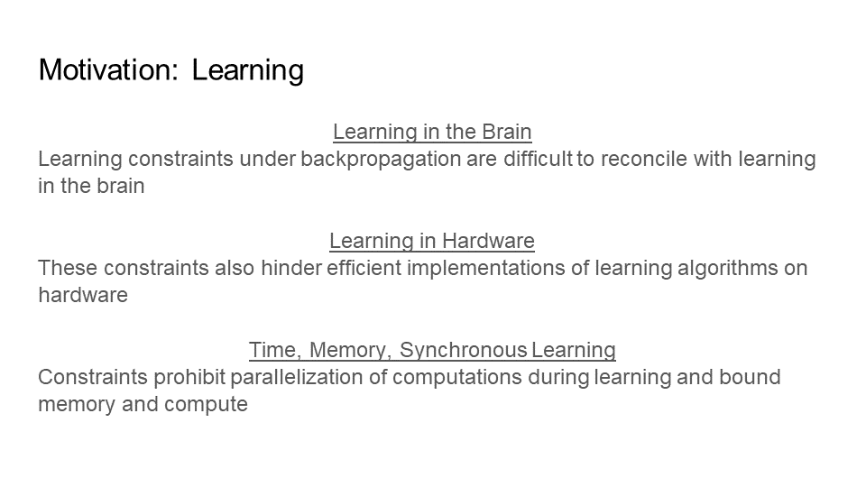

Table of Contents
1. [Introduction](#1-introduction)\
  1.1. [Previous Approaches to Learning](#11-previous-approaches-to-learning)\
  1.2. [A New Framework for Learning](#12-a-new-framework-for-learning)\
  1.3. [The Problem with Learning Constraints](#13-the-problem-with-learning-constraints)
  
## 1. Introduction

### 1.1. Previous Approaches to Learning
Learning is the active ingredient in making artificial neural networks work. Backpropagation is recognized as the best performing learning algorithm, powering the success of artificial neural networks. However, it is a highly constrained learning algorithm. And, it is these constraints that are seen as necessary for its high performance. It is well accepted that reducing even some of these constraints lowers performance. However, due to these same constraints, backpropagation has problems with efficiency and compatibility. It is not efficient with time, memory, and energy. It has low compatibility with biological models of learning, neuromorphic chips, and edge devices. So, one may think to address this problem by reducing different subsets of constraints in an attempt to increase efficiency and compatibility without heavily lowering performance.

For example, two constraints of backpropagation on the training network are: (1) the addition of feedback weights that are symmetric with the feedforward weights; and (2) the requirement of having these feedback weights for every neuron. The inference network never uses the feedback weights, that is why we refer to them as learning constraints. Subsets of these constraints include: not adding any feedback weights, only adding feedback weights for one or two layers in a five layer network, not having the feedback weights be symmetric, or any combination of these. This means constraints can be added or removed in part or entirely to form subsets of constraints to reduce. One may keep trying to reduce different subsets of these constraints, in an attempt to increase efficiency and compatibility, and hope to not heavily impact performance.

Previous alternative learning algorithms to backpropagation have attempted relaxing constraints, without success. They reduce subsets of constraints on learning to improve efficiency and compatibility. They keep other constraints, with the expectation of retaining performance similar to the performance found by keeping all the constraints (which is backpropagation). So, this implies there is a spectrum for learning constraints, from highly constrained, such as backpropagation, to no constraints, such as Signal Propagation, the framework I am introducing here.

### 1.2. A New Framework for Learning
Now, I demonstrate a shift away from previous works. The results presented here provide support that the least constrained learning method, Signal Propagation, has better performance, efficiency, and compatibility than alternatives to backpropagation that selectively reduce constraints on learning. This includes well established and highly impactful methods such as random feedback alignment, direct feedback alignment, and local learning (all without backpropagation). This is a fascinating insight into learning across fields from neuroscience to computer science. It benefits areas from biological learning (e.g. in the brain) to artificial learning (e.g. in neural networks, hardware, neuromorphic chips).

Signal Propagation also significantly informs the direction of future research in learning algorithms where backpropagation is the standard of comparison. On the spectrum of learning constraints, contrary to the highly constrained backpropagation, Signal Propagation is the least constrained method to compare with and to start from for developing learning algorithms. With only backpropagation as a best performing comparison, learning algorithms did not have a starting point, only an end goal. Now, I am introducing Signal Propagation as the new baseline for learning algorithms to assess their efficiency, compatibility, and performance.

### 1.3. The Problem with Learning Constraints
 
What are the constraints found under backpropagation?\
Why are they an issue?

Learning constraints under backpropagation are difficult to reconcile with learning in the brain. Below, I provide the main constraints: 
- A complete forward pass through the network is required before sequentially delivering feedback in reverse order during a backward pass. 
- The training network needs the addition of comprehensive feedback connectivity for every neuron. 
- There are two different computations for learning and for inference. In other words, the feedback algorithm is a distinct type of computation, separate from feedforward activity.
- The feedback weights need to be symmetric with the feedforward weights.

These constraints also hinder efficient implementations of learning algorithms on hardware for the following reasons: 
- weight symmetry is incompatible with elementary computing units which are not bidirectional.
- transportation of non local weight and error information requires special communication channels.

These learning constraints prohibit parallelization of computations during learning and increase memory and compute for the following reasons:
- The forward pass needs to complete before the backward pass can begin (Time, Sequential)
- Activations of hidden layers need to be stored during the forward pass for the backward pass (Memory)
- Backward pass requires special feedback connectivity (Structure)
- Parameters are updated in reverse order of the forward pass (Time, Synchronous)

<picture>
 
</picture>