Table of Contents
3. [Learning in a Forward Pass](#3-learning-in-a-forward-pass)\
  3.1. [The Approach to Learn](#31-the-approach-to-learn)\
  3.2. [The Steps to Learn](#32-the-steps-to-learn)\
  3.3. [Overview of Complete Procedure](#33-overview-of-complete-procedure)\
  3.4. [Spiking Networks](#34-spiking-networks)

## 3. Learning in a Forward Pass

### The Signal Propagation Framework (SP)
I present here, the Framework for Learning and Inference in a Forward Pass, called Signal Propagation (SP). It is a satisfyingly straightforward solution to temporal and spatial credit assignment. SP is a least constrained method for learning, and yet has better performance, efficiency, and compatibility than previous alternatives to backpropagation. It also has better efficiency and compatibility than backpropagation. SP provides a reasonable performance tradeoff for efficiency and compatibility. This is particularly appealing, considering it's compatibility for target based deep learning (e.g. supervised and reinforcement) with new hardware and long-standing biological models, whereas previous works are not. (In general, backpropagation is the best performing algorithm.)

SP is free of constraints for learning to take place, with:
- only a forward pass, no backward pass
- no feedback connectivity or symmetric weights
- only one type of computation for learning and inference.
- a learning signal which travels with the input in the forward pass
- updates to parameters once the neuron/layer is reached by the forward pass

An interesting insight, SP provides an explanation for how neurons in the brain without error feedback connections receive global learning signals.

As a result, Signal Propagation is:
- Compatible with models of learning in the brain and in hardware.
- More efficient in learning, with lower time and memory, and no additional structure.
- A low complexity algorithm for learning.

### 3.1. The Approach to Learn

Signal Propagation treats the target as an additional input (figure below). With this approach, SP feeds the target forward through the network, as if it were an input.
<picture>
 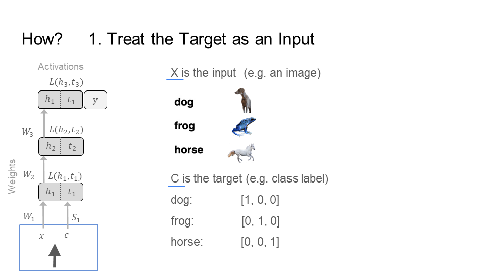
</picture>

SP moves forward through the network (figure below), bringing the target and the input closer and closer together, starting from the first layer (top left) all the way to the last layer (bottom right). Notice that by the last step/layer, the image of the dog is close to its target [1,0,0], and the image of the frog is close to its target [0, 1, 0]. However, the image and target of the dog is far away from the frog. This operation takes place in the representational space of the neurons at each layer. For instance, the neurons at layer 1 take in the dog picture (the input x) and dog label (the target c) and output activations h_1_dog and t_1_dog, respectively. The same happens for the frog producing h_1_frog and t_1_frog. In this activation space of the neurons, SP trains the network to bring an input and its target closer together, but farther away from other inputs and their respective targets.
<picture>
 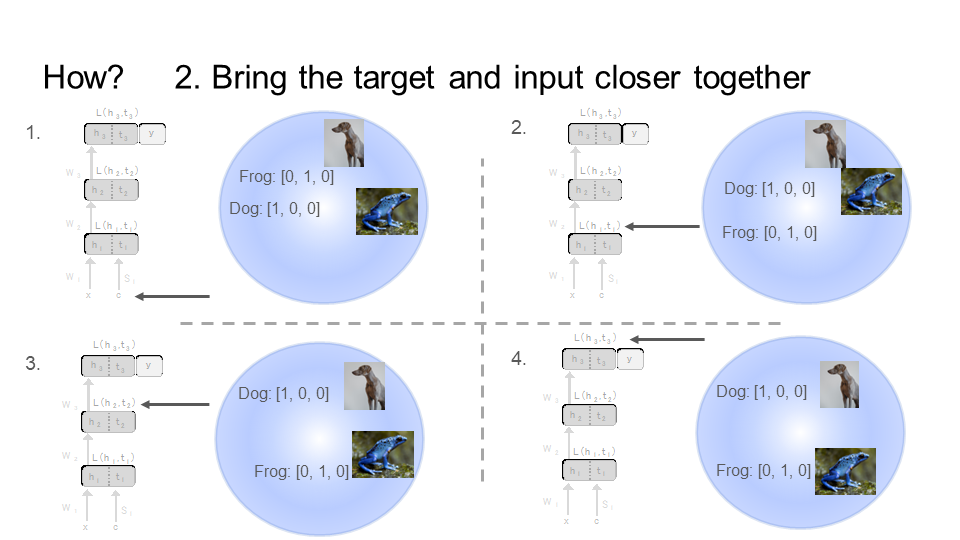
</picture>
Layer by layer, bring the target and its respective input closer together, but farther from the other input and target. Images of animals from Upsplash.

### 3.2. The Steps to Learn
Below is the total picture for an example three layer network. Each layer has its own loss function, which is used to update weights in the network. So, SP executes the loss function and updates the weights as soon as the target and label reach a layer. Since SP feeds the target and input together (alternating), layer/neuron weights are updated immediately. For spatial credit assignment, SP updates weights without waiting for the input to reach the last layer from the first layer. For temporal credit assignment, SP provides a learning signal for (each time step) each of the multiple connected inputs (e.g. images in a video), without waiting for the last input to be fed into the network.
<picture>
 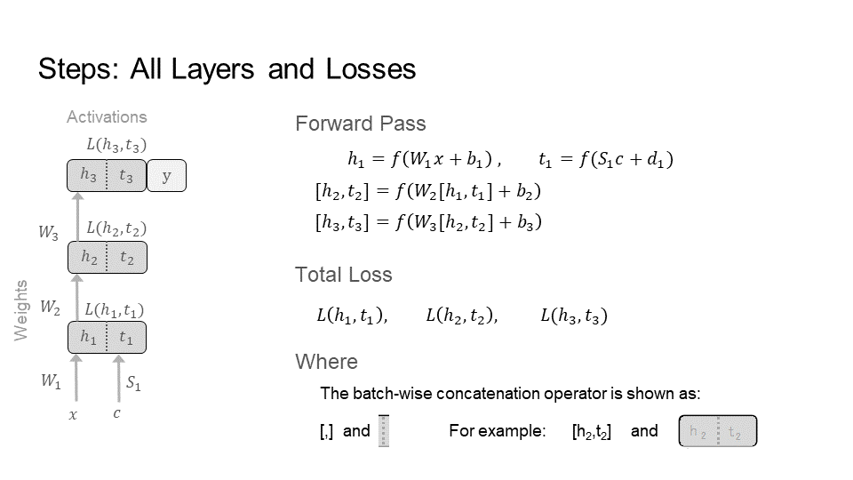
</picture>
This is a three layer network. The forward pass for learning and inference will proceed in three steps. Each layer has its own loss; a total of three losses. The inputs are x, and the targets are c, both fed in through the front of the network.

<picture>
 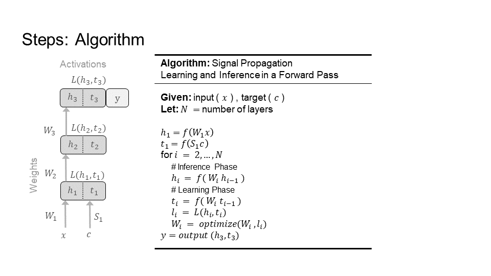
</picture>
The overall algorithm for learning and inference in a forward pass. The inference and learning phases run in parallel, such that each layer's weights are updated immediately. Notes: For the network shown (left), N = 3, the number of layers. The biases (b and d) are left out for clarity. There are many choices for a loss L (e.g. gradient, Hebbian) and optimizer (e.g. SGD, Momentum, ADAM). The output(), y, is detailed in step 4 below.

Below, we will go step by step, layer by layer, doing learning and inference (i.e. producing an answer/prediction) in forward passes. Note, in the guide below, the target and input are batch concatenated into a forward pass, making it easier to follow.

#### Step 1) Layer 1
<picture>
 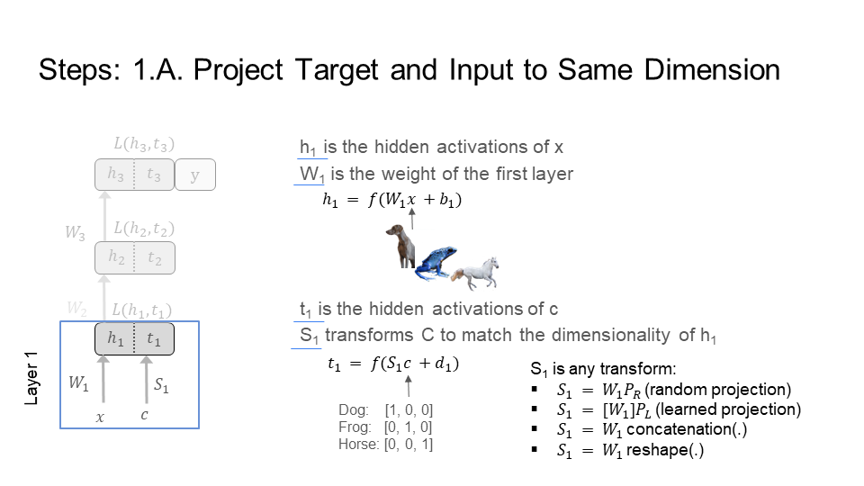
</picture>
<picture>
 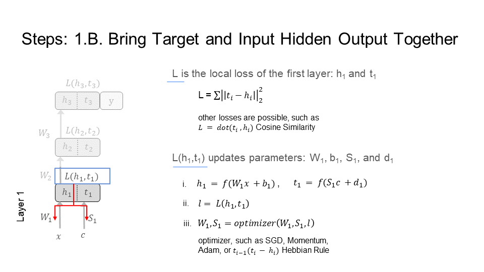
</picture>	
<picture>
 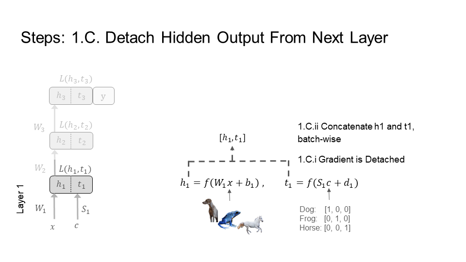
</picture>	

#### Step 2) Layer 2
<picture>
 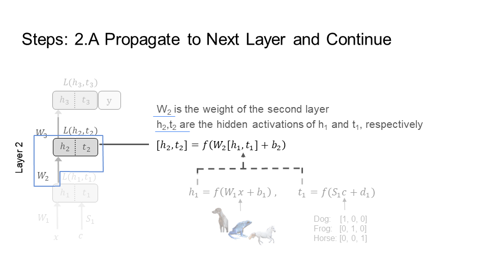
</picture>	
<picture>
 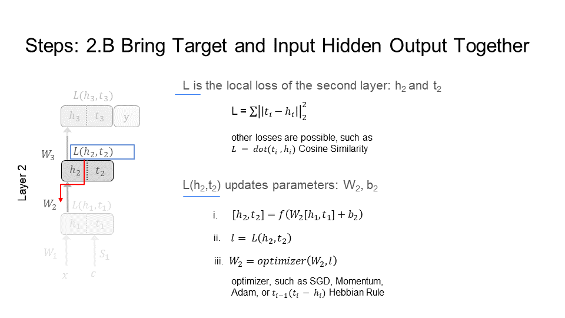
</picture>	
<picture>
 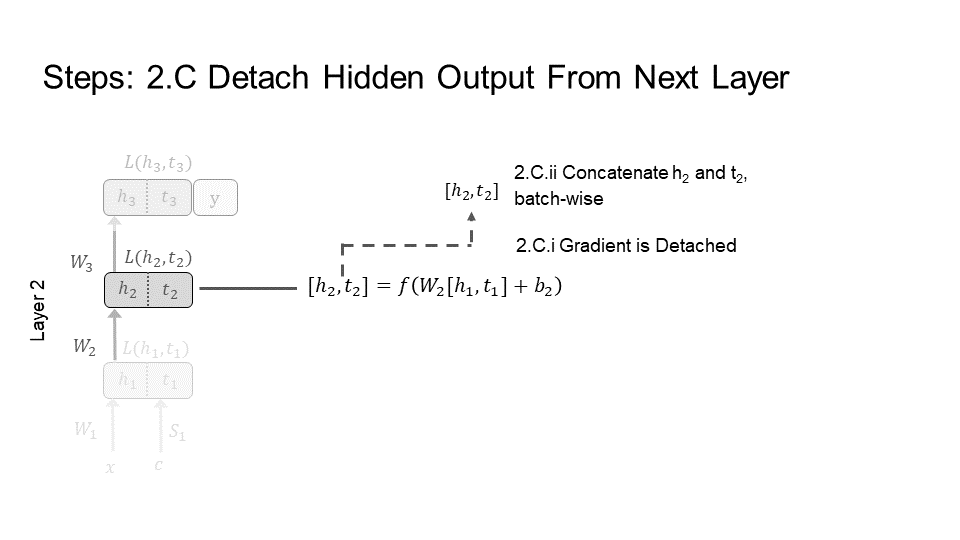
</picture>	

#### Step 3) Layer 3
<picture>
 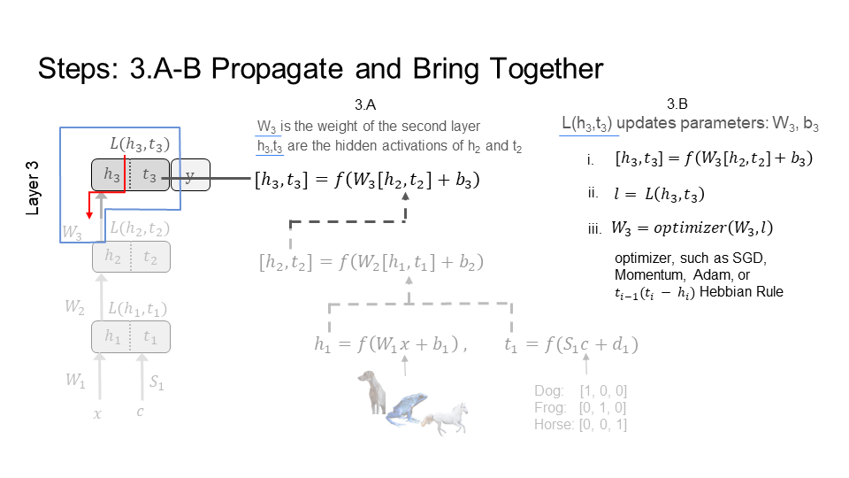
</picture>	

#### Step 4) Prediction
At the output layer, there are three choices for outputting a prediction. The first and second options provide more flexibility and follow naturally from the procedure to train using a forward pass. The first option is to take an h_3 for a class and compare it with each t_3 for every class. For example, SP inputs the image of a dog and gets h_3_dog , then inputs the labels for all the classes and gets t_3_i = { t_3_dog, t_3_frog, and t_3_horse}, finally it compares h_3_dog with each of the t_3_i; the closes t_3_i is the correct class.

The second option is an adaptive version of the first option. It is adaptive since SP no longer compares h_3_dog with every t_3_i, instead finds a subset of closest t_3_i. For example, we maintain a tree where t_3_frog is closer in the tree to t_3_dog than t_3_horse. So, we first compare h_3_dog to t_3_frog, then to t_3_dog, and stop. We never compare with t_3_horse as it is too far away and not in our subset of closest t_3_i.

The third option: the classical and intuitive choice is to train a prediction output layer. This option is also more straightforward for regression and generative tasks. For example, a classification layer, which has has one output per class. So, layer 3 would be a classification layer. Note, that during inference t_3 is not longer used. In addition, notice that t_3_i is equivalent to having a classification layer. To see this, simply concatenate t_3_i together to form the weight matrix of a classification (prediction) layer that is taken with h_3 (e.g. h_3_dog, h_3_horse, …). This means that  this third option is a special case of the first option, and can be a special case of the second option.

<picture>
 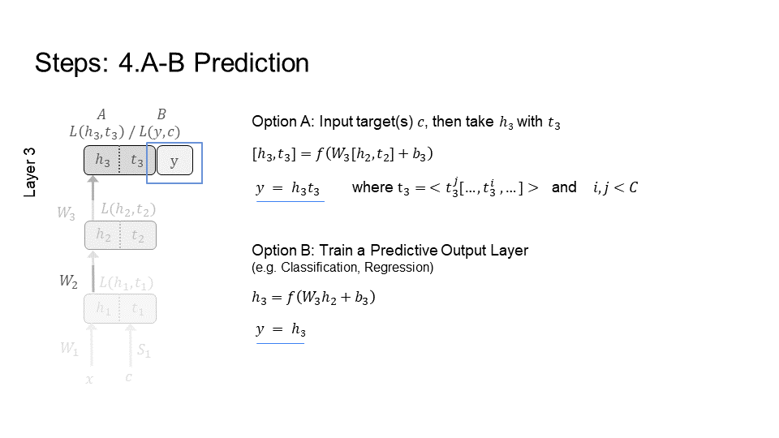
</picture>	
<picture>
 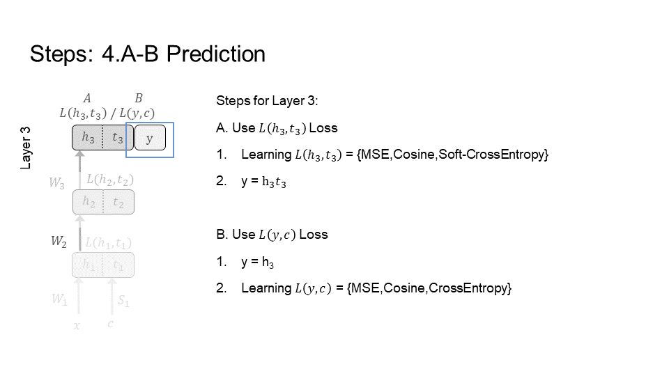
</picture>	
<picture>
 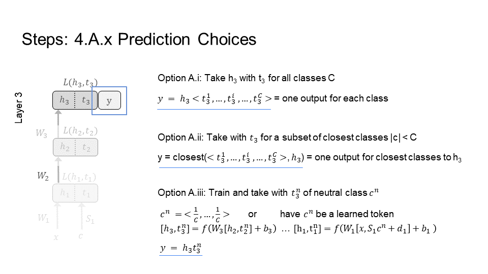
</picture>	

### 3.3. Overview of Complete Procedure

<picture>
 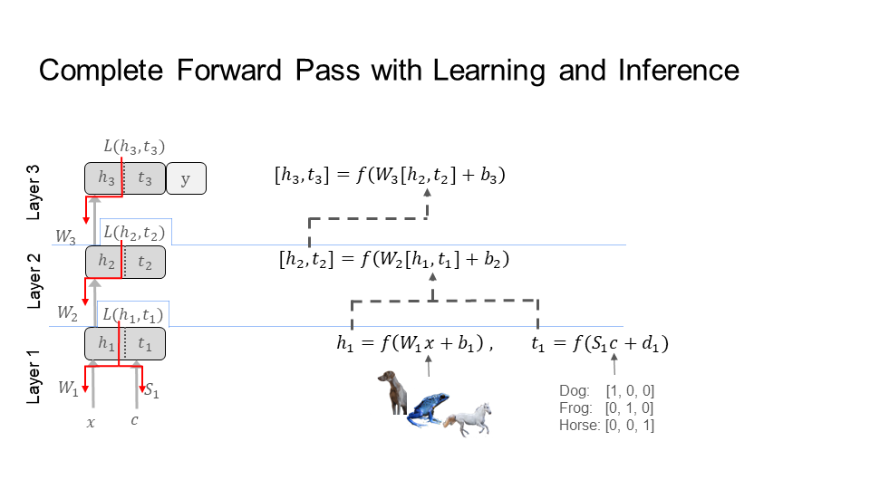
</picture>	
<picture>
 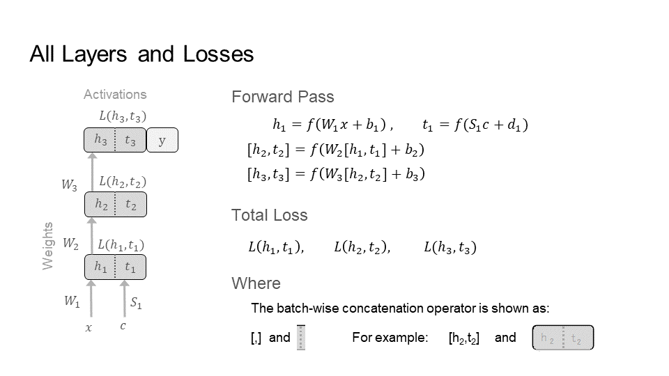
</picture>	

### 3.4. Spiking Networks

Spiking neural networks are similar to biological neural networks. They are used in models of learning in the brain. They are also used for neuromorphic chips. There are two problems for learning in spiking neural networks. First, the learning constraints under backpropagation are difficult to reconcile with learning in the brain, and hinders efficient implementations of learning algorithms on hardware (discussed above). Second, training spiking networks results in the dead neuron problem (see below).

A reference figure is provided below. The neurons in these networks respond to inputs by either activating (spiking) to convey information to another neuron or by doing nothing (top-left figure). Commonly, these networks have a problem where neurons never activate, which means they never spike (bottom-left figure). Thereby, regardless of the input, the neurons response is to always do nothing. This is called the dead neuron problem.

The most popular approach to resolve this problem uses a surrogate function to replace the spiking behavior of the neurons. The network uses the surrogate only during learning, when the learning signal is sent to the neurons. The surrogate function (blue) provides a value for the neuron even when it does not spike (top-right figure). So, the neuron learns even when it does not spike to convey information to another neuron (bottom-right figure). This helps stop the neuron from dying. However, surrogates are difficult to implement for learning in hardware, such as neuromorphic chips. Furthermore, surrogates do not fit models of learning in the brain.

Signal Propagation provides two solutions that are compatible with models of learning in the brain and in hardware.

<picture>
 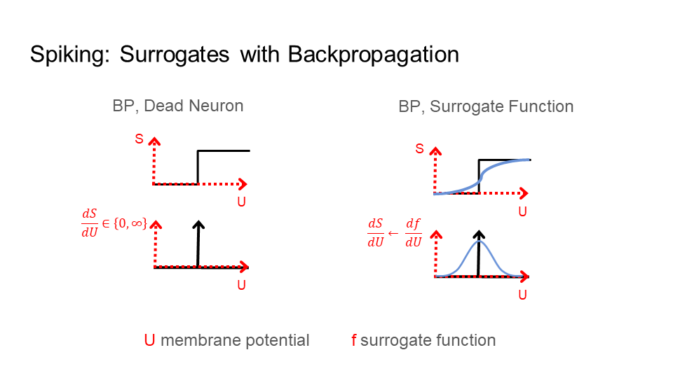
</picture>	

Below is a visualization of the learning signal (colored in red) going through a spiking neuron (shown as S), past the voltage or membrane potential (U), to update the weights (W). Backpropagation, with the dead neuron problem, is on the left. Backpropagation, with a surrogate function (f), is second from the left. The learning signal for backpropagation is global (L_G) and comes from the last layer of the network; the dotted boxes are upper neurons/layers.

The other images on the right show the two solutions Signal Propagation (SP) provides. First, SP can use a surrogate as well, but the learning signal does not go through the spiking equation (S). Instead, the learning signal is before the spiking equation (S), directly attached to the surrogate function (f). As a result, SP is more compatible with learning in the brain, such as in a multi compartment model of a biological neuron. Second, SP can learn using only the voltage or membrane potential (U). In this case, the learning signal is directly attached to U. This requires no surrogate or change to the neuron. Thereby, SP provides compatibility with learning in hardware.
<picture>
 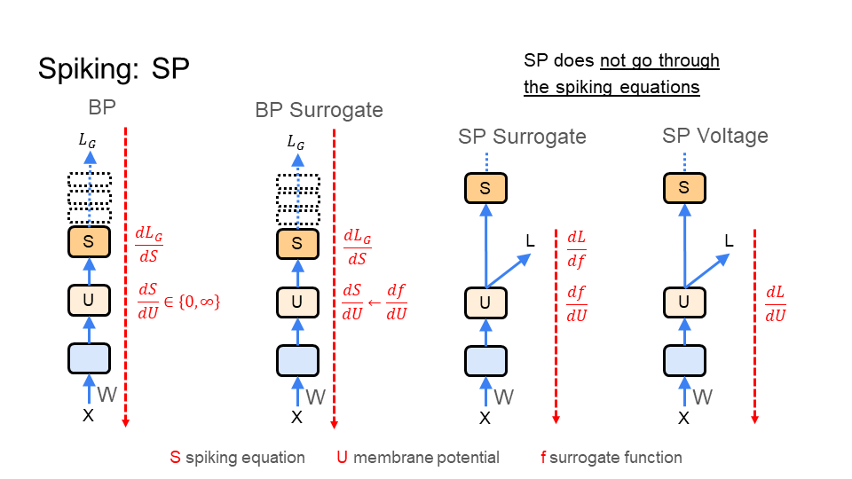
</picture>	
