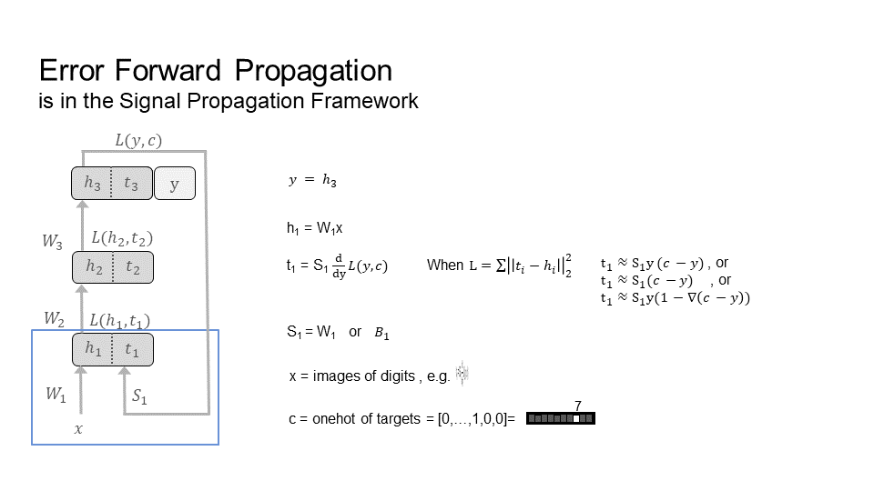
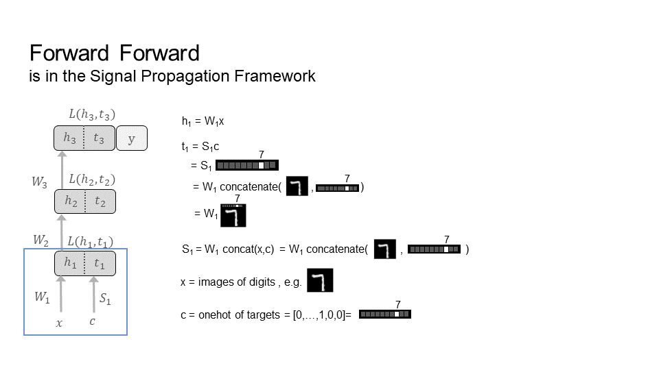
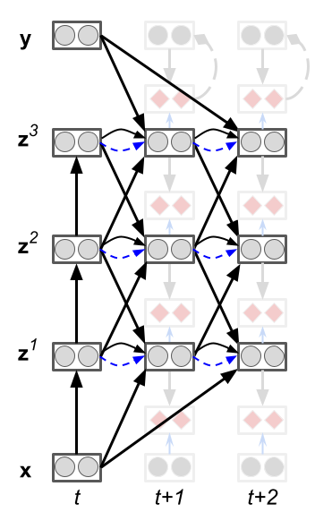
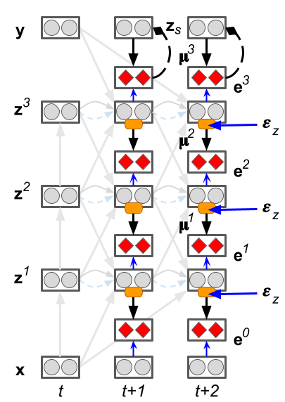

Table of Contents
4. [Works on Forward Learning](#4-works-on-forward-learning)\
  4.i. [Add Your Work](#4i-add-your-work)\
  4.1. [Error Forward Propagation (2018)](#41-error-forward-propagation-2018)\
  4.2. [Forward Forward (2022)](#42-forward-forward-2022)

## 4. Works on Forward Learning

A list of works on forward learning, using the forward pass for learning. Works are ordered by date.

### 4.i. Add your work
Contact me or [submit a pull request](https://github.com/amassivek/amassivek.github.io) to add a paragraph and slide on your work. The content is at your discretion. I may provide minor edits (e.g. grammar and positioning).

### 4.1. Error Forward Propagation (2018)

The error forward propagation algorithm is an implementation of the signal propagation framework for learning and inference in a forward pass (figure below). Under signal propagation, S is the transform of the context c, which for supervised learning is the target. In error forward propagation, S is the projection of the error from the output to the front of the network, as shown in the figure below.

<picture>
 
</picture>	

Error Forward-Propagation: Reusing Feedforward Connections to Propagate Errors in Deep Learning\
[arxiv](https://arxiv.org/abs/1808.03357)

### 4.2. Forward Forward (2022)

The forward forward algorithm is an implementation of the signal propagation framework for learning and inference in a forward pass (figure below). Under signal propagation, S is the transform of the context c, which for supervised learning is the target. In forward forward, S is a concatenation of the target c with the input x, as shown in the figure below.

<picture>
 
</picture>	

Forward Forward Algorithm\
[arxiv](https://www.cs.toronto.edu/~hinton/FFA13.pdf)

### 4.3. Predictive Forward Forward (2022)

The predictive forward-forward (PFF) algorithm is a generalization of the forward-forward (FF) learning rule and predictive coding, focusing on adaptation in a recurrent neural system that combines local top-down, lateral, and bottom-up information when iteratively processing sensory patterns. PFF specifically centers around the idea that two neural circuits can jointly learn from one another, i.e., a representation circuit that focuses on rapidly acquiring representations (by contrasting positive and negative samples, as in FF) and a noisy generative circuit that focuses on synthesizing these representations (each layer of this circuit tries to locally predict the activities of the representation circuit). The top-most layer of the generative circuit contains a multimodal prior over neural activities which can then be readily sampled from in order to "fantasize" data points (based on its memories) on-the-fly. PFF notably further introduces a simple spatially and temporally local scheme for adapting cross-inhibitory and self-excitation synapses within a layer of neurons.

Predictive Forward-Forward Algorithm\
[arxiv](https://arxiv.org/abs/2301.01452)

<table>
<tr>
<td>
<picture>
 
</picture>	
</td>
<td>
<picture>
 
</picture>	
</td>
</tr>
</table>